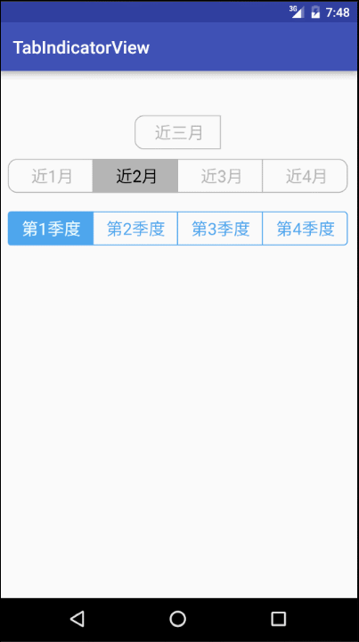

# TabIndicatorView
一个简单的tab导航控件

 

useage
---
in your xml:
-

    <com.zhl.tabindicatorview.view.TabIndicatorView
        android:id="@+id/tab_indicator_view2"
        android:layout_width="match_parent"
        android:layout_height="40dp"
        android:layout_marginLeft="10dp"
        android:layout_marginRight="10dp"
        android:layout_marginTop="20dp"
        app:tabCheckBGcolor="#4ea6ed"
        app:tabCheckedTextColor="#efffff"
        app:tabCornerRadiu="10"
        app:tabUnCheckBGcolor="#4ea6ed"
        app:tabUnCheckedTextColor="#4ea6ed" />
        
in code:
-

    TabIndicatorView indicatorView = (TabIndicatorView) findViewById(R.id.tab_indicator_view);

    indicatorView.initTabs(items, new TabIndicatorView.OnTabItemCheckListener() {
            @Override
            public void onTabItemCheck(TabItemView itemTabView, int position) {
                Toast.makeText(MainActivity.this,"当前选中=="+position,Toast.LENGTH_SHORT).show();
            }
        });
具体属性见源码
---
